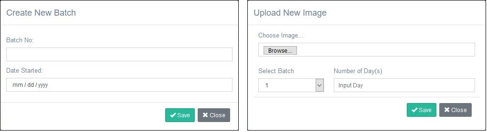
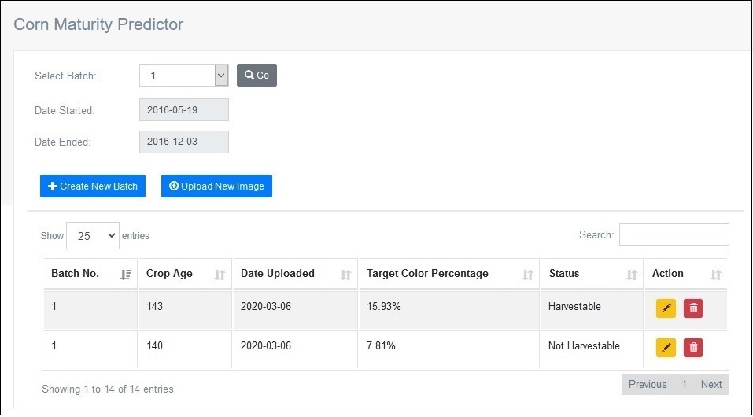

## About the Web-Based Corn Maturity Predictor

The Web-Based Corn Maturity Predictor built using Laravel Web Application Framework and OpenCV-Python with CRUD Basic Operation.

- Image Processing
- Color Detection Algorithm
- Data Analytics 
- Maturity Prediction

## Built Using

- Laravel Web Framework
- JQuery AJAX
- OpenCV-Python
- SweetAlert2
- LAMP (Software Bundle)

## Create New Batch and Upload New Corn Image Forms

## Table View

